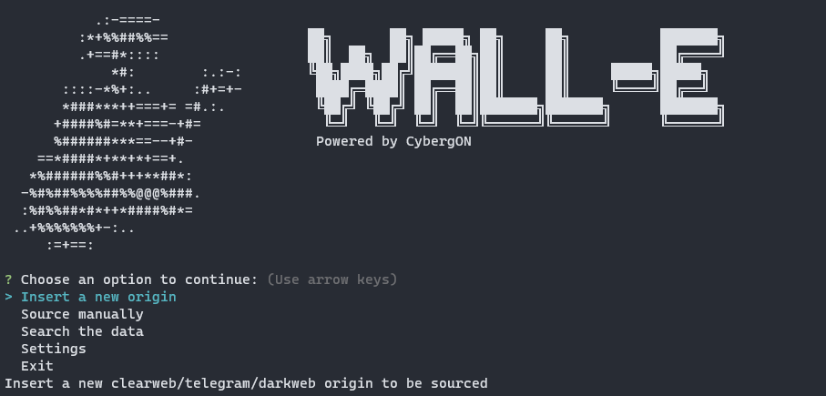
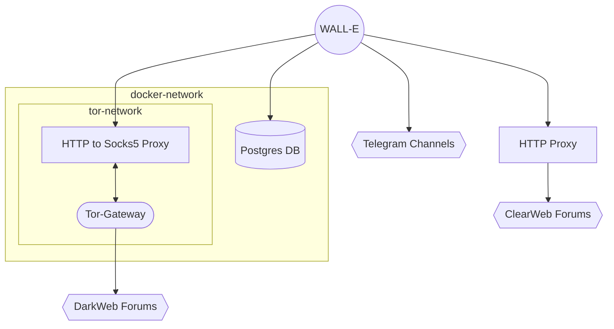
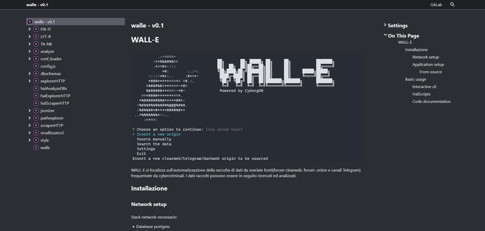

# WALL-E



WALL-E si focalizza sull'automatizzazione della raccolta di dati da svariate fonti(forum clearweb, forum .onion e canali Telegram) frequentate da cybercriminali. I dati raccolti possono essere in seguito ricercati ed analizzati.



## Installazione
### Network setup

Stack network necessario:
- Database postgres
- Rete Tor:
	- Traduttore da proxy http a socks5
	- Gateway per la rete tor

Queste componenti possono essere configurate ed impostate manualmente. In alternativa è possibile utilizzare il file DockerCompose di deploy presente in `/net_deploy`

**Prerequisiti**:
- docker
- docker-compose

```bash
cd net_deploy
docker-compose up

> ✔ Network net_deploy_default        Created
> ✔ Network net_deploy_tor-network    Created
> ✔ Container tor_gateway             Created
> ✔ Container postgres_db             Created
> ✔ Container http2socks5_proxy       Created
```

### Application setup

**Prerequisiti**:
- node.js
#### From source
Installazione requisiti:
```bash
npm install
```
Compilazione e configurazione di dist a partire dai file typescript:
```bash
npm run build
cd dist
```
Avvio dell'applicativo
```bash
node walle.js
```
## Basic usage

### Interactive cli
```sh
node walle.js
```
### HalScripts

#### halAnalyzeDBs
Analyzes a database or a directory of databases and loads metadata and entries in the postgres db

Example:
```sh
node halAnalyzeDBs.js --target_file "/path/to/file"
```
#### halExplorerHTTP
Explore a new origin, classifies the html paths and inserts the result in the postgresDB

Example:
```sh
node halExplorerHTTP.js --url "https://example.com"
```
#### halScraperHTTP
Runs a manual scraping of the clearweb/darkweb origins in the postgresDB

Example:
```sh
node halScraperHTTP.js --dark
```
#### tginsert
Adds a new telegram origin to the database

Example:
```sh
python tginsert.py --AddOrigin "telegram_tag"
```
#### tgscrape
Scrape manually the telegram origins saved in the database

Example:
```sh
python tgscrape.py
```

### Code documentation

You can build the documentation related to your version of the code by running `npx typedoc` in the main directory.
The built documentation can be found in the `/docs` directory in html filetype. Entry point: `index.html`

